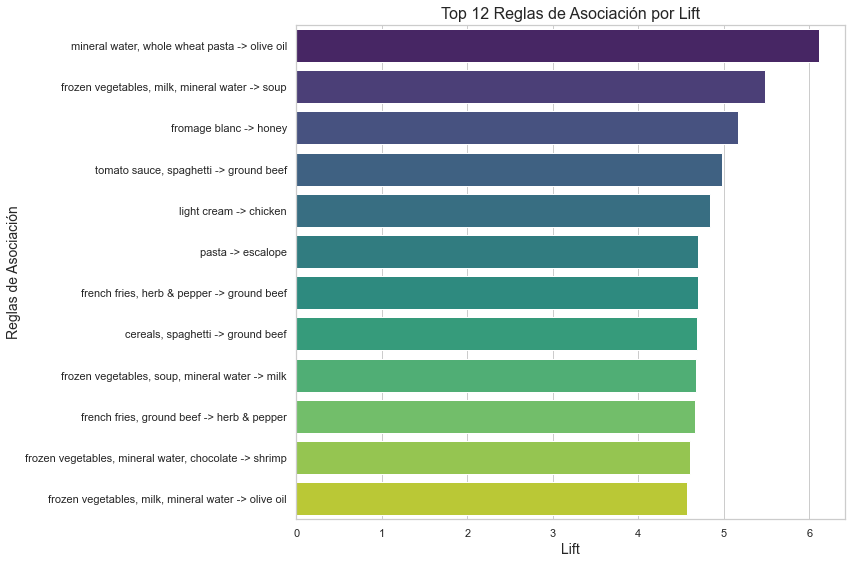

# Análisis de Reglas de Asociación en Datos de Supermercado utilizando el Algoritmo Apriori 


## Tabla de Contenidos

- [Descripción del Proyecto](#descripción-del-proyecto)
- [Tecnologías Utilizadas](#tecnologías-utilizadas)
- [Instalación](#instalación)
- [Uso](#uso)
- [Resultados](#resultados)
  - [Reglas de Asociación Más Importantes](#reglas-de-asociación-más-importantes)
- [Visualizaciones](#visualizaciones)
- [Utilidades y Aplicaciones](#utilidades-y-aplicaciones)
- [Consideraciones Finales](#consideraciones-finales)
- [Licencia](#licencia)
- [Contacto](#contacto)

## Descripción del Proyecto

Este proyecto tiene como objetivo analizar patrones de compra en un supermercado utilizando el **algoritmo Apriori** para la minería de reglas de asociación. Mediante el análisis de un dataset que registra los productos comprados en cada transacción, se identifican asociaciones significativas entre diferentes productos. Estos insights permiten optimizar estrategias de marketing, la disposición de productos en la tienda, promociones cruzadas y mejorar la experiencia de compra de los clientes.

## Tecnologías Utilizadas

- **Python 3.8+ y spyther**
- **Pandas**: Manipulación y análisis de datos.
- **Apyori**: Implementación del algoritmo Apriori.
- **Matplotlib** y **Seaborn**: Visualización de datos.
- **CSV**: Manejo de archivos de datos.

## Instalación

1. **Clonar el Repositorio**

   ```bash
   git clone https://github.com/tu_usuario/nombre_del_repositorio.git
   ```


## Uso

1. **Ejecutar el Script de Análisis**

   ```bash
   python apriori_analysis.py
   ```

   Este script realizará el análisis de las reglas de asociación, imprimirá las 12 reglas más importantes en la terminal y generará visualizaciones.

## Resultados

### Reglas de Asociación Más Importantes

A continuación, se presentan las **12 reglas de asociación más importantes** basadas en el **Lift** obtenido del análisis con el algoritmo Apriori:

1. **Regla:** `mineral water, whole wheat pasta → olive oil`  
   **Soporte:** 0.0039  
   **Confianza:** 0.40  
   **Lift:** 6.12  
   **Interpretación:** Clientes que compran agua mineral y pasta integral tienen una probabilidad 6.12 veces mayor de también comprar aceite de oliva en comparación con compras aleatorias.

2. **Regla:** `frozen vegetables, milk, mineral water → soup`  
   **Soporte:** 0.0031  
   **Confianza:** 0.28  
   **Lift:** 5.48  
   **Interpretación:** De las transacciones que incluyen vegetales congelados, leche y agua mineral, el 28% también incluye sopa, aumentando la probabilidad de compra de sopa en 5.48 veces.

3. **Regla:** `fromage blanc → honey`  
   **Soporte:** 0.0033  
   **Confianza:** 0.25  
   **Lift:** 5.16  
   **Interpretación:** El 25% de los clientes que compran fromage blanc también compran miel, con una asociación 5.16 veces más fuerte de lo esperado.

4. **Regla:** `tomato sauce, spaghetti → ground beef`  
   **Soporte:** 0.0031  
   **Confianza:** 0.49  
   **Lift:** 4.98  
   **Interpretación:** El 49% de las transacciones que incluyen salsa de tomate y spaghetti también incluyen carne molida, con un Lift de 4.98.

5. **Regla:** `light cream → chicken`  
   **Soporte:** 0.0045  
   **Confianza:** 0.29  
   **Lift:** 4.84  
   **Interpretación:** El 29% de las compras de crema ligera incluyen pollo, con una fuerte asociación de 4.84.

6. **Regla:** `pasta → escalope`  
   **Soporte:** 0.0059  
   **Confianza:** 0.37  
   **Lift:** 4.70  
   **Interpretación:** El 37% de las compras de pasta también incluyen escalope, indicando una asociación de 4.70 veces.

7. **Regla:** `french fries, herb & pepper → ground beef`  
   **Soporte:** 0.0032  
   **Confianza:** 0.46  
   **Lift:** 4.70  
   **Interpretación:** El 46% de las transacciones que incluyen papas fritas y hierbas & pimienta también incluyen carne molida, con un Lift de 4.70.

8. **Regla:** `cereals, spaghetti → ground beef`  
   **Soporte:** 0.0031  
   **Confianza:** 0.46  
   **Lift:** 4.68  
   **Interpretación:** El 46% de las compras de cereales y spaghetti incluyen carne molida, con un Lift de 4.68.

9. **Regla:** `frozen vegetables, soup, mineral water → milk`  
   **Soporte:** 0.0031  
   **Confianza:** 0.61  
   **Lift:** 4.67  
   **Interpretación:** El 61% de las transacciones que incluyen vegetales congelados, sopa y agua mineral también incluyen leche, con un Lift de 4.67.

10. **Regla:** `french fries, ground beef → herb & pepper`  
    **Soporte:** 0.0032  
    **Confianza:** 0.23  
    **Lift:** 4.67  
    **Interpretación:** El 23% de las compras de papas fritas y carne molida también incluyen hierbas & pimienta, con un Lift de 4.67.

11. **Regla:** `frozen vegetables, mineral water, chocolate → shrimp`  
    **Soporte:** 0.0032  
    **Confianza:** 0.33  
    **Lift:** 4.60  
    **Interpretación:** El 33% de las transacciones que incluyen vegetales congelados, agua mineral y chocolate también incluyen camarones, con un Lift de 4.60.

12. **Regla:** `frozen vegetables, milk, mineral water → olive oil`  
    **Soporte:** 0.0033  
    **Confianza:** 0.30  
    **Lift:** 4.57  
    **Interpretación:** El 30% de las compras de vegetales congelados, leche y agua mineral también incluyen aceite de oliva, con un Lift de 4.57.

## Visualizaciones

### Gráfico de Barras de Lift de las 12 Reglas Más Importantes



El gráfico muestra las 12 reglas de asociación más importantes ordenadas por su valor de Lift. Las barras indican la magnitud del Lift para cada regla, facilitando la identificación de las asociaciones más fuertes entre productos.

## Utilidades y Aplicaciones

### 1. **Optimización de la Disposición de Productos en la Tienda**

- **Agrupación de Productos Asociados:** Colocar juntos los productos que frecuentemente se compran juntos, como pasta integral, agua mineral y aceite de oliva, para facilitar la compra conjunta.
- **Zonas de Comidas Complejas:** Crear secciones dedicadas a ingredientes para comidas completas, como ingredientes para sopas, pastas o comidas rápidas.

### 2. **Promociones y Descuentos**

- **Paquetes Combinados:** Ofrecer paquetes o descuentos cuando se compran productos asociados juntos, incentivando así la compra de múltiples artículos.
- **Ofertas Temporales:** Implementar promociones temporales en productos clave para aumentar el tráfico y las ventas en momentos específicos.

### 3. **Marketing y Comunicación**

- **Recetas y Sugerencias:** Proporcionar recetas en la tienda o a través de canales de marketing que destaquen cómo combinar los productos asociados.
- **Contenido Educativo:** Educar a los clientes sobre los beneficios de las combinaciones de productos saludables, como el uso de aceite de oliva con pasta integral.

### 4. **Gestión de Inventarios**

- **Stock Adecuado:** Asegurar que los productos que se compran juntos estén siempre en stock para evitar frustrar a los clientes y perder ventas.
- **Análisis de Demanda:** Utilizar estas reglas para anticipar la demanda de productos específicos y optimizar el inventario en consecuencia.

### 5. **Mejora de la Experiencia del Cliente**

- **Facilidad de Compra:** Facilitar la compra de productos relacionados agrupándolos en la tienda o mediante la creación de listas de compras sugeridas.
- **Personalización:** Ofrecer recomendaciones personalizadas basadas en el historial de compras de los clientes, utilizando estas reglas de asociación como base.


# Licencia: MIT License
Parte del código tomado de: https://github.com/joanby/machinelearning-az/tree/master/original/Part%205%20-%20Association%20Rule%20Learning/Section%2028%20-%20Apriori/Apriori_Python 

